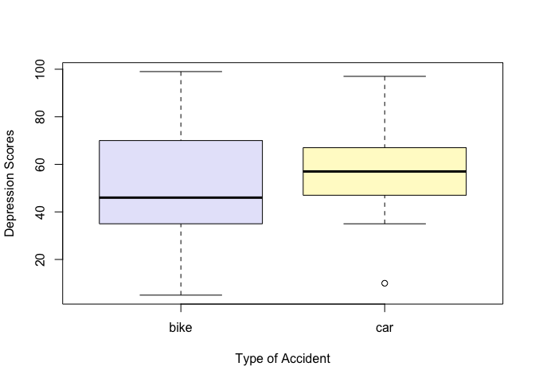

P8130 Biostatistical Methods I - Homework 1
================
22 September 2024

# Question 2

## Bike Crash History

The following data set represents 14 individuals with recent bike crash
history:

45, 39, 25, 47, 49, 5, 70, 99, 74, 37, 99, 35, 8, 59

The following represents the mean, median, range, and standard deviation
of the depression scores, as well as a summary of the key
characteristics.

``` r
bike = c(45, 39, 25, 47, 49, 5, 70, 99, 74, 37, 99, 35, 8, 59)

mean(bike)
```

    ## [1] 49.35714

``` r
median(bike)
```

    ## [1] 46

``` r
max(bike) - min (bike)
```

    ## [1] 94

``` r
sd(bike)
```

    ## [1] 28.84603

``` r
summary(bike)
```

    ##    Min. 1st Qu.  Median    Mean 3rd Qu.    Max. 
    ##    5.00   35.50   46.00   49.36   67.25   99.00

## Car Crash History

The following data set represents 13 individuals with recent car crash
history:

67, 50, 85, 43, 64, 35, 47, 97, 58, 58, 10, 56, 50

The following represents the mean, median, range, and standard deviation
of the depression scores, as well as a summary of the key
characteristics.

``` r
car = c(67, 50, 85, 43, 64, 35, 47, 97, 58, 58, 10, 56, 50)

mean(car)
```

    ## [1] 55.38462

``` r
median(car)
```

    ## [1] 56

``` r
max(car) - min(car)
```

    ## [1] 87

``` r
sd(car)
```

    ## [1] 21.58139

``` r
summary(car)
```

    ##    Min. 1st Qu.  Median    Mean 3rd Qu.    Max. 
    ##   10.00   47.00   56.00   55.38   64.00   97.00

## Combining Two Vectors Using cbind

``` r
crash_history = cbind(bike, car)
```

## Pass crash_history to a Boxplot

``` r
boxplot(
  crash_history, 
  title = "Boxplot of Depression Scores by Type of Accident", 
  ylab = "Depression Scores", 
  xlab = "Type of Accident",
  col = c("lavender", "lemonchiffon") 
)
```

<!-- -->

# Question 4

## Given Probabilities

``` r
P_D = 0.05
P_P_given_D = 0.80
P_P_given_no_D = 0.10
```

## Calculating P

``` r
P_no_D = 1 - P_D
```

## Law of Total Probability to calculate P(P)

``` r
P_P = (P_P_given_D * P_D) + (P_P_given_no_D * P_no_D)
```

## Bayes Theorem

``` r
P_D_given_P = (P_P_given_D * P_D)/(P_P)
```
